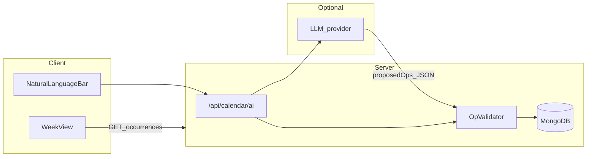

# AI / implementation context

Single source of truth for **coding** decisions. Requirements prose lives in `docs/projectRequirements.md` and `docs/uiDesign.md` (do not edit those from automation; use `docs/suggestedUpdates.md` for proposed deltas).

Current product name for UI/metadata: **WeekWise** (temporary).

UI visual language (customer-facing):

- Target style: clean, modern, minimal cards/buttons similar to the provided reference sign-in aesthetic
- Color distribution guideline across screens: **60% white**, **30% black/near-black text and lines**, **10% accent**
- Accent color: **`#66AA3C`**
- Accent token must be centralized in global styles (single change point) and then consumed across components

## Stack and hosting

- **Next.js** (App Router), **TypeScript** front and back
- **Implementation language rule**: this codebase does **not** use Python runtime code for product features. Build and API implementation stay in Next.js + TypeScript.
- **Vercel** hosting
- **MongoDB** persistence (official `mongodb` driver; adapter for Auth.js where applicable)
- Current MongoDB Atlas naming: cluster **`bigCluster`**, project **`Y12Project`**

## Assessment notification (teacher doc)

The official Assessment 3 notification mentions **Python / Flask / SQLite** and a **`requirements.txt`** for local teacher runs. This project intentionally uses the **approved student stack** from `docs/projectRequirements.md` (Next.js + TS + MongoDB). For marking, keep the folio aligned with outcomes: **automated tests** for critical logic, **README** with env placeholders (no secrets in repo), and note that **review is expected on the hosted deployment**; local MongoDB is optional for the teacher.

## Auth

- **No traditional passwords**
- **6-digit code** sign-in: user enters **email** → server issues short-lived code (default delivery: **email**; dev may log or use a mail provider when configured)
- **Google OAuth** as a second sign-in path
- OTP email delivery provider: **Resend** (`RESEND_API_KEY`, `RESEND_FROM_EMAIL`)
- Session handling via **Auth.js (next-auth v5)** with MongoDB for users/accounts where appropriate; all calendar mutations require an authenticated `userId`

## How the user interacts with the product

- **AI-first**: most create / move / reschedule / bulk edits happen through natural language (bottom bar: “add tasks, edit calendar…”)
- **Direct UI** (minimal): mark tasks complete, delete items, reschedule **overdue** tasks (orange state + control per `docs/uiDesign.md`), open card **modal** for read/edit details
- **AI may create and delete both tasks and activities** when the user asks
- **Activities**: **`movable` defaults to `false`** unless the user (or their AI instruction) explicitly says they can be moved

## Time, locale, and “working hours”

- Default **IANA timezone**: `Australia/Sydney`
- Default **working hours** (visible range in week view): **06:00–22:00** local
- **Hybrid todo + calendar**: items have a duration in minutes (e.g. **15**); week view lays them out by time within working hours

## Split sessions (one logical item, multiple blocks)

- A single scheduled item may be worked in **non-contiguous segments** (e.g. 2×1h for a 2h task) **without** creating duplicate top-level rows in Mongo or duplicate **cards** in the UI
- **Invariant**: one **occurrence** (or series instance) owns **`segments: { startAt, endAt }[]`** (≥1). The UI renders **one card** per occurrence; internal rendering may show sub-ranges or a compact summary. Splitting/merging is a **scheduling concern**, not separate “items” for the same intent

## Recurrence

- Support **rich user phrasing** (“every week except these two weeks”, “skip date X”, etc.)
- Implementation direction: **RRULE + EXDATE** and/or explicit **exception overrides** on occurrences; AI proposes structured ops; **server validates** conflicts with `movable`, working hours, and other hard rules

## Database shape (conceptual)

Authoritative per-user data:

| Concept | Purpose |
|--------|---------|
| `User` | Identity, preferences (`timezone`, `workingHours`) |
| `CalendarSeries` | Template: `type` (`task` \| `activity`), title, notes, `movable`, `colorHex`, recurrence fields, duration, task-only metadata (priority, due, etc.) |
| `CalendarOccurrence` | Concrete placement: `seriesId`, `userId`, `segments[]`, completion state for tasks, `source` (user/ai), exception flags |

Every query and mutation **filters by `userId`** (authorisation).

## AI ↔ calendar (do not dump the whole calendar)

For each request send only:

- User **message** (intent)
- A **narrow time window** (e.g. active week ± buffer) and **compact busy summary** (`startAt`/`endAt` + short label)
- **Constraints**: timezone, working hours, which items are **immovable**, deadlines, priorities

The model returns **structured operations** (create/update/delete/move, with explicit ids where needed). The server runs a **deterministic validator** (collisions, movable rules, segment sanity) then **applies** updates to Mongo. If `GEMINI_API_KEY` is absent (e.g. teacher machine), the AI step may **no-op or return a safe error** without exposing secrets.

## Views

- UI supports **swappable views**; v1 is **week view** only (`docs/uiDesign.md`). Keep a small registry (e.g. `views/week.tsx`) so additional views plug in later without rewriting the shell.

## Env vars (names only; values not committed)

- `MONGODB_URI`
- `AUTH_SECRET`
- `AUTH_GOOGLE_ID` / `AUTH_GOOGLE_SECRET` (or Auth.js canonical names — mirror in `.env.example`)
- `GEMINI_API_KEY` (optional; production and dev demos; model `gemini-2.5-flash`)
- Email transport vars if/when real OTP email is wired (e.g. `EMAIL_FROM`, provider API key)

### Structured prompt fallback accepted by backend

When Gemini output is invalid, backend attempts deterministic parsing for lines like:
- `Name: ...`
- `Type: Task|Activity`
- `Time: 8:30am-3:00pm`
- `StartDate: 7/5/26` (or `YYYY-MM-DD`)
- `Repeat: True|False`
- `RepeatEveryDays: 7`
- `Movable: Yes|No`
- `CalendarColour: #RRGGBB`

## Open point

- **6-digit code delivery**: default **email**; SMS only if you later require it (would change env + provider integration).
